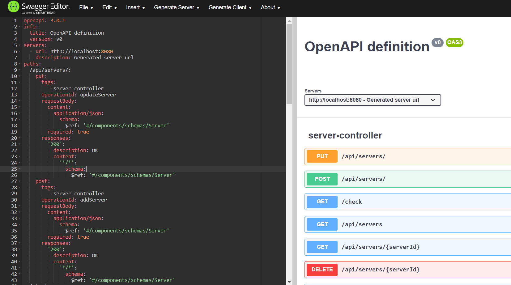
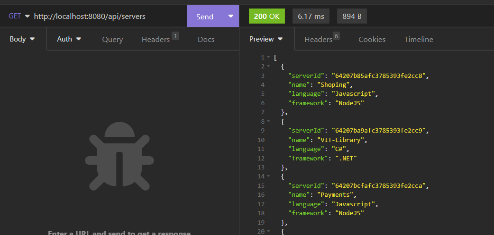
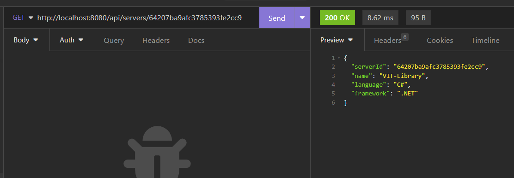
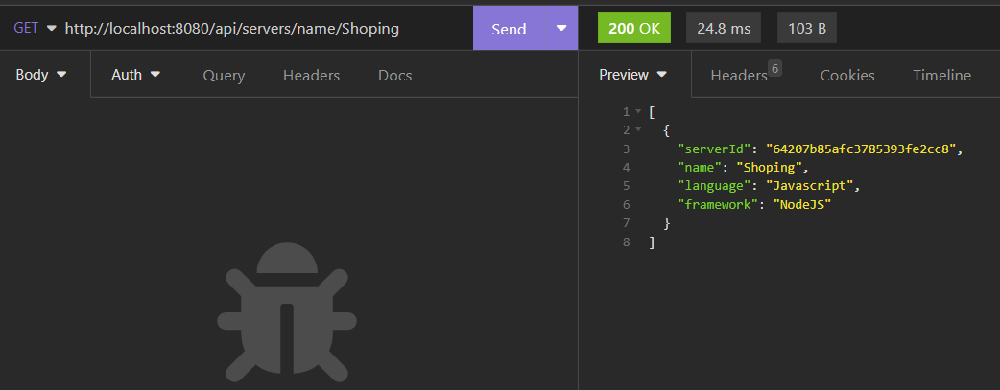
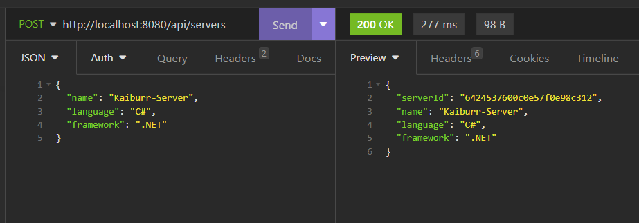
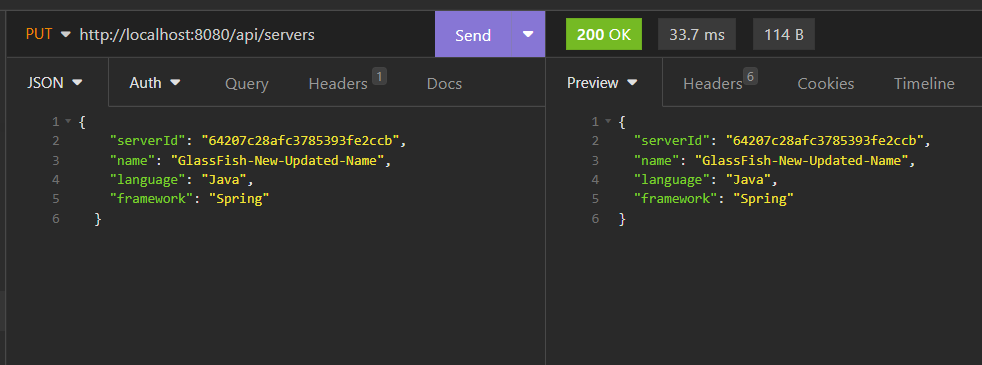
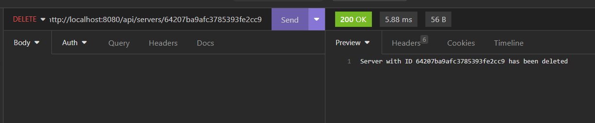

# Task-2-Kaiburr-Assessment

#### The purpose of this repository is to provide a solution to Task 2 from the Kaiburr's Assessment. Submitted by Dev Bilaspure.

### Task Description
The task requires creating a REST API using the Swagger Editor and a Java-based server or framework. The server code can be generated either manually or through the online editor. The API must have the same functionality as described in task #1. The generated code must be deployable and runnable, and the API's responses must be demonstrated using an HTTP client such as Postman or curl.

### Project Description
To complete the task, I did the following:

- Generated a api-docs using `springdoc-openapi-starter-webmvc-ui` in JSON file from the Spring Boot REST API created in task 1.
- Used Swagger Editor to create the API definition and generate the server code stub using Spring Boot as the framework.
- Implemented the same 6 functionalities same as in task 1.
- Tested all 6 API endpoints using Insomnia client tool.
- Verified that the API responded appropriately to each request

## Overview  (this section is generated by Swagger)
This server was generated by the [swagger-codegen](https://github.com/swagger-api/swagger-codegen) project.  
By using the [OpenAPI-Spec](https://github.com/swagger-api/swagger-core), you can easily generate a server stub.  
This is an example of building a swagger-enabled server in Java using the SpringBoot framework.

The underlying library integrating swagger to SpringBoot is [springdoc-openapi](https://github.com/springdoc/springdoc-openapi)

Start your server as an simple java application  

You can view the api documentation in swagger-ui by pointing to  
http://localhost:8080/  

Change default port value in application.properties

## Generated Server Stub Using Swagger Editor

## REST API Endpoints
#### 1. Get list of all servers
- URL: `/api/servers`
- Method: GET
- Description: Returns a list of all server documents.
- Screenshot of API Request from Insomnia client tool:

#### 2. Get server by ID
- URL: `/api/servers/{serverId}`
- Method: GET
- Description: Returns a server document by its ID.
- Screenshot of API Request from Insomnia client tool:

#### 3. Get list of servers by name
- URL: `/api/servers/name/{name}`
- Method: GET
- Description: Returns a list servers document by name.
- Screenshot of API Request from Insomnia client tool:
  

#### 4. Add server
- URL: `/api/servers`
- Method: POST
- Description: Adds a new server document.
- Screenshot of API Request from Insomnia client tool:
  

#### 5. Update server
- URL: `/api/servers`
- Method: PUT
- Description: Updates an existing server document.
- Screenshot of API Request from Insomnia client tool:
  

#### 6. Delete server by ID
- URL: `/api/servers/{serverId}`
- Method: DELETE
- Description: Deletes a server document by its ID.
- Screenshot of API Request from Insomnia client tool:
  

